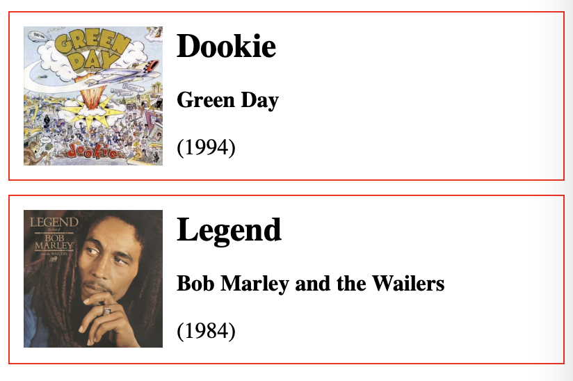

# Exercises for JS1 Lesson 4.2: Creating HTML Dynamically

## Exercise 1

Given the Array:

```js
const potatoes = ["Kerrs pink", "Beate", "Laila", "Asterix", "Pimpernel", "Juno", "Mandelpotet"]
```

Make a function, that accepts an Array as parameter/argument and generate one list item for each item in the Array, and saves that into a String, that is returned from the function.

Invoke the function, with `potatoes` as argument, and take the returned string, and add that to the `innerHTML` of an `ul` element in your HTML file.

## Exersise 2

Given the Array of Objects:

```js
const students = [
{ firstName: "Weronika", lastName: "Vik" },
{ firstName: "Ingebrigt Furnes", lastName: "Bøe" },
{ firstName: "Amund", lastName: "Halgunset" },
{ firstName: "Erland Heen", lastName: "Halvorsen" },
{ firstName: "Toby Haywood", lastName: "Sveen" },
{ firstName: "Bård", lastName: "Teigstad" },
{ firstName: "Petrine", lastName: "Lynghaug" },
{ firstName: "Maren", lastName: "Johansen" },
{ firstName: "Herman", lastName: "Jasser" },
{ firstName: "Erik", lastName: "Torkildsen" },
{ firstName: "Amelia", lastName: "Bujar" },
{ firstName: "Ole-Martin", lastName: "Bull" },
{ firstName: "Frank Kristian", lastName: "Fosse" },
{ firstName: "Daniel", lastName: "Østensen" },
];
```

Make a function, that accepts an Array as parameter/argument, sorts the Array, based on `lastName` (remember using [`localeCompare()`](https://developer.mozilla.org/en-US/docs/Web/JavaScript/Reference/Global_Objects/String/localeCompare#examples)), and generate one list item for each object in the Array, on the form: `<li>firstName lastName</li>`.
 
Save the list items into a String, that is returned from the function.

Invoke the function, with `students` as argument, and take the returned string, and add that to the `innerHTML` of an `ul` element in your HTML file.

Level 2: 

Start by listing the students in original order, then make three buttons:

* Original order
* Sort by first name
* Sort by last name

Make eventLiasteners for the two sort-buttons, that sorts the list appropriately, then lists them out on the page. (Make sure to use [`slice()`](https://developer.mozilla.org/en-US/docs/Web/JavaScript/Reference/Global_Objects/Array/slice) before sorting or [`toSorted()`](https://developer.mozilla.org/en-US/docs/Web/JavaScript/Reference/Global_Objects/Array/toSorted).)

Let the eventlister for Original order, do just that, and list on the page as they appear in the original array.

Should you make some helper functions?

## Exercise 3

Given the pseudo JSON string: 

```js
const myCats = `
{
    "theStarks": [
        { "name":"Sansa", "color":"brownish stripes", "hair":"short", "gender":"female" },
        { "name":"Arya (RIP)", "color":"grayish stripes", "hair":"short", "gender":"female" },
        { "name":"Bran", "color":"light orange stripes", "hair":"long", "gender":"male" }
    ]
}
`;
```

a) Create an ul-element using `createElement()`.

b) Using `createElement()`, make list item for each cat, each with a `textNode` and set them into the ul-element. 

The form for each list item should be similar to this for all 3: 
* Sansa, a female cat, fur is short haired with brownish stripes. 

c) Append the ul-element to you HTML-file.

Level 2: Change "is" to "was" for poor Arya.

## Exercise 4

Given the pseudo JSON string: 

```js
const bestAlbumsOfAllTime = `
{
    "albums": [
        { "title":"Dookie", "artist":"Green Day", "year": 1994, "cover":"https://www.geek.no/noroff/albums/Green_Day_-_Dookie_cover.jpg" },
        { "title":"London Calling", "artist":"The Clash", "year": 1979, "cover":"https://www.geek.no/noroff/albums/TheClashLondonCallingalbumcover.jpg" },
        { "title":"The Number of the Beast", "artist":"Iron Maiden", "year": 1982, "cover":"https://www.geek.no/noroff/albums/IronMaiden_NumberOfBeast.jpg" },
        { "title":"Nevermind", "artist":"Nirvana", "year": 1991, "cover":"https://www.geek.no/noroff/albums/NirvanaNevermindalbumcover.jpg" },
        { "title":"The Final Cut", "artist":"Pink Floyd", "year": 1983, "cover":"https://www.geek.no/noroff/albums/FloydFC-Cover01.jpg" },
        { "title":"Appetite For Destruction", "artist":"Guns N’ Roses", "year": 1987, "cover":"https://www.geek.no/noroff/albums/GunsnRosesAppetiteforDestructionalbumcover.jpg" },
        { "title":"Legend", "artist":"Bob Marley and the Wailers", "year": 1984, "cover":"https://www.geek.no/noroff/albums/BobMarley-Legend.jpg" },
        { "title":"Tattoo You", "artist":"The Rolling Stones", "year": 1981, "cover":"https://www.geek.no/noroff/albums/TattooYou81.jpg" },
        { "title":"The Process of Belief", "artist":"Bad Religion", "year": 2002, "cover":"https://www.geek.no/noroff/albums/BadReligionTheProcessOfBelief.jpg" },
        { "title":"The Stone Roses", "artist":"The Stone Roses", "year": 1989, "cover":"https://www.geek.no/noroff/albums/Stoneroses.jpg" }
    ]
}
`;
```

a) Create an ol-element using `createElement()`.

b) List albums in the order given into the ul-element element in given order, on the form: 
1. Dookie, Green Day, 1994
2. London Calling, The Clash, 1979
3. etc.

c) Append the ul-element to you HTML-file.

d) Make a CSS file and style the list and list items, so it looks something like this (or better):



Level 2: Use the "new look" on the rest of the exercises:

Make 4 buttons with the ids: `button#sortByArtist`, `button#sortByYearAsc`, `button#sortByYearDesc` and `button#originalOrder`.

e) Add an event listener to `button#sortByArtist` and make a function that sorts the lists, and re-lists on the page, sorted on the value of the Artist (alphabetically, ascending, ie. the normal way).

f) Add another eventlistener to `button#sortByYearAsc`, and make a function that sorts the list by the numeric value of the year, and lists the albums in ascending order (oldest first).

e) Add another eventlistener to `button#sortByYearDesc`, and make a function that sorts the list by the numeric value of the year, and lists the albums in descending order (newest first).

f) Add another eventlistener to `button#originalOrder` that re-lists the albums in the original order given. 

## Exersise 5

Given the Array of Objects:

```js
const cars = [
    { make: "Ford", model: "Taurus", year: 2005 },
    { make: "Volvo", model: "XC90", year: 2020 },
    { make: "Volvo", model: "XC60", year: 2020 },
    { make: "BMW", model: "M3", year: 2012 },
    { make: "Ford", model: "Escort", year: 2012 },
    { make: "BMW", model: "X1", year: 2020 },
    { make: "BMW", model: "M3", year: 2000 },
    { make: "Ford", model: "Escort", year: 2008 },
    { make: "Ford", model: "Taurus", year: 2018 },
    { make: "Volvo", model: "XC60", year: 2019 }
];
```

Make a function, that accepts an Array as parameter/argument.

Generate a `div` for each item in the Array, using [`DOMParser`](https://developer.mozilla.org/en-US/docs/Web/API/DOMParser) and the [`parseFromString()` method](https://developer.mozilla.org/en-US/docs/Web/API/DOMParser/parseFromString). Save all the divs into a String, that is returned from the function.

Each `div` should look like this: 
```js
`<div>
    <h2>Ford</h2>
    <p><strong>Taurus</strong></h2>
    <p>2005</p>
</div>`
```

Invoke the function, with `cars` as argument, and take the returned string, get the content, and append it into `index.html` file.

Level 2: 

Let the function sort the Array before adding it to the page, the compare function should first sort based on `make`, then - if they are the same - the `model`, and - if they are also the same - the `year`, descending (newest first). (Tip: Look at the example [Sorting array of objects](https://developer.mozilla.org/en-US/docs/Web/JavaScript/Reference/Global_Objects/Array/sort#sorting_array_of_objects)).
